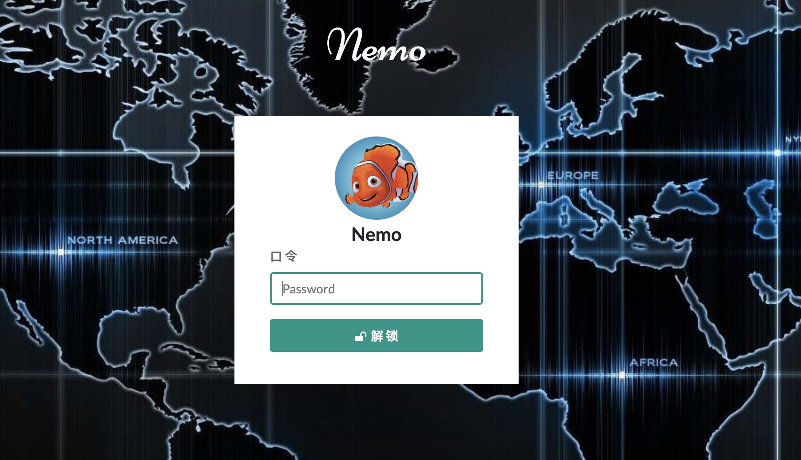
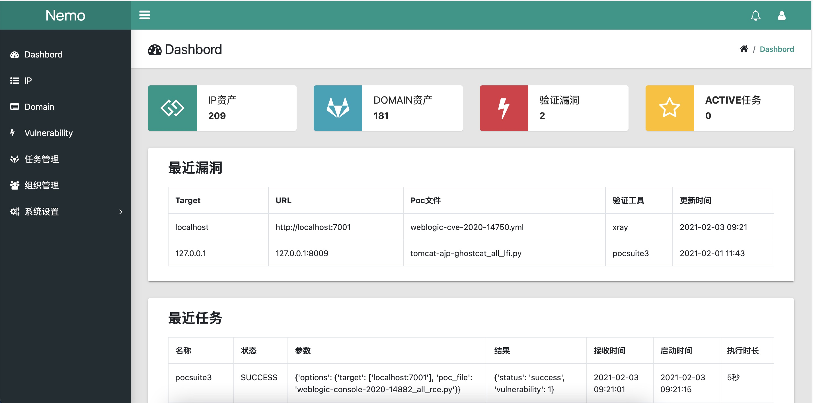

# Nemo

Nemo是用来进行自动化信息收集的一个简单平台，实现对内网及互联网资产信息的自动收集，提高隐患排查和渗透测试的工作效率。


# 功能

- Nmap/Masscan进行端口扫描（需本地nmap/masscan）

- 第三方接口查询IP归属地（hao7188、ip.cn）

- 子域名收集（Sublist3r）

- 子域名爆破（修改版ESD）

- Fofa的API接口对IP和域名信息收集（需要Fofa的KEY）

- Shodan的API接口对IP信息收集（需要Shodan的KEY）

- WhatWeb收集端口和域名的指纹（需本地whatweb）

- Pocsuite3与XRay进行漏洞验证

- 信息资产的导出、统计、颜色标记与备忘录协作

- Celery实现分布式任务

- Docker部署和运行

## 安装

[开发环境配置](docs/config.md)

[MacOS安装配置](docs/install_mac.md)

## Docker

```shell
git clone https://github.com/hanc00l/nemo
cd nemo
docker build  -t nemo/app:v1 .
docker run -it -d --name nemo_app -p 5000:5000 nemo/app:v1
```

## 使用
浏览器输入 [http://localhost:5000](http://localhost:5000)，默认用户名密码：**nemo/nemo**







## 参考

jeffzh3ng：https://github.com/jeffzh3ng/fuxi

TideSec：https://github.com/TideSec/Mars